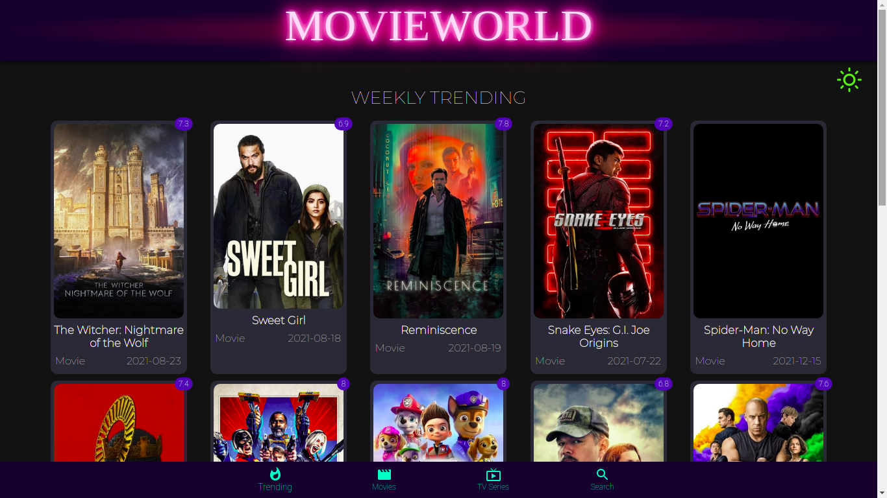

   

 ### `This is a Movie App bulid using React.js, React hooks, States, axios, Material UI, API.`

## 👁 Sneak-peak 👁

## See Deployment

# Getting Started with your own Create React App
### `npx create-react-app my-app cd my-app npm start`

## How to use this Repository

1. You should have the latest version of Nodejs and Npm installed in your local machine.
2. Before cloning, you need to have git in your local machine.
3. clone the repo, by running this commmand in terminal.

    ### `git clone https://github.com/ArshWalker/movie_world.git` 

4. go to your project repository

    ### `cd movie_world`

5. In the project directory, you can run:

     ### `npm start`

     Runs the app in the development mode.\
     Open [http://localhost:3000](http://localhost:3000) to view it in the browser.

     The page will reload if you make edits.\
     You will also see any lint errors in the console.
